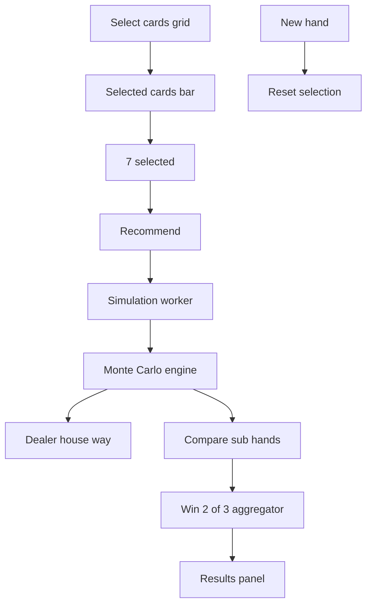

# Asia Poker 4 2 1 app architecture

Target platform: Python 3.9 plus, cross platform Windows and macOS. GUI toolkit: Qt via PySide6. Default simulator samples 100k with UI slider.

## Project layout
- [README.md](../README.md)
- [requirements.txt](../requirements.txt)
- [assets/cards](../assets/cards) PNG card art named like AS.png KD.png 9H.png 2C.png XJ.png
- [src/app.py](../src/app.py)
- [src/gui/main_window.py](../src/gui/main_window.py)
- [src/gui/card_selector.py](../src/gui/card_selector.py)
- [src/gui/selected_status_bar.py](../src/gui/selected_status_bar.py)
- [src/gui/results_panel.py](../src/gui/results_panel.py)
- [src/gui/workers.py](../src/gui/workers.py)
- [src/gui/style.qss](../src/gui/style.qss)
- [src/core/cards.py](../src/core/cards.py)
- [src/core/ranks.py](../src/core/ranks.py)
- [src/core/partition.py](../src/core/partition.py)
- [src/core/house_way.py](../src/core/house_way.py)
- [src/core/simulate.py](../src/core/simulate.py)
- [src/core/evaluator.py](../src/core/evaluator.py)
- [tests](../tests)
- [docs](../docs)

## Data model
- Card: rank 2..10 J Q K A and Joker XJ; suit S H D C or None for Joker; canonical id like AS KD 9H 2C XJ. Implemented in [src/core/cards.py](../src/core/cards.py).
- RankScore: immutable tuple encoding category then tie breakers for fast comparison across 4 card, 2 card, 1 card. Implemented in [src/core/ranks.py](../src/core/ranks.py).

## Core algorithms
- Partition generation: enumerate all 4 2 1 partitions of 7 cards. Count is 105 before foul filtering. Provide iterator plus pre ranked cache. [src/core/partition.py](../src/core/partition.py)
- Dealer house way: deterministic mapping from 7 cards to 4 2 1 using the citation backed rules. [src/core/house_way.py](../src/core/house_way.py)
- Monte Carlo: sample dealer 7 cards from remaining 46 cards without replacement. Share each sample across all player partitions to amortize cost. Vectorize comparisons where possible. [src/core/simulate.py](../src/core/simulate.py)
- Evaluator: compute best partition by maximizing P win two of three; return top N alternatives with metrics. [src/core/evaluator.py](../src/core/evaluator.py)

## GUI workflow
- Deck grid with 53 clickable cards; already selected cards are disabled.
- Status bar with 7 clickable slots to remove replace individual cards.
- Controls: Recommend button, sample size slider 10k..500k with 100k default, progress bar and Cancel, New Hand.
- Results: show recommended 4 2 1 with card images, probability estimate, CI, and top alternatives.
- Threading: QThread worker runs simulation to keep UI responsive.

## Mermaid overview

## Performance notes
- Cache RankScore for all 105 partitions per player hand.
- Pre compute integer encodings for fast numpy vector ops.
- Optional numba JIT for bottleneck loops guarded by availability.

## Packaging later
- Keep pure Python with PySide6 to run via python on Windows and macOS. Add PyInstaller build scripts later if desired.
